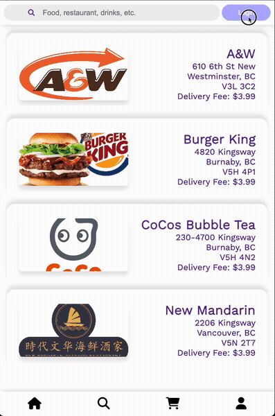
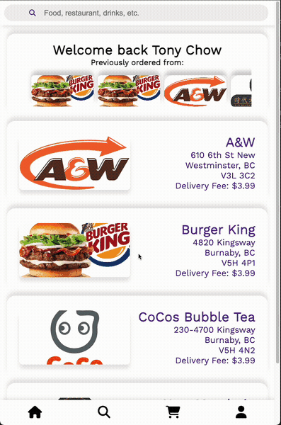
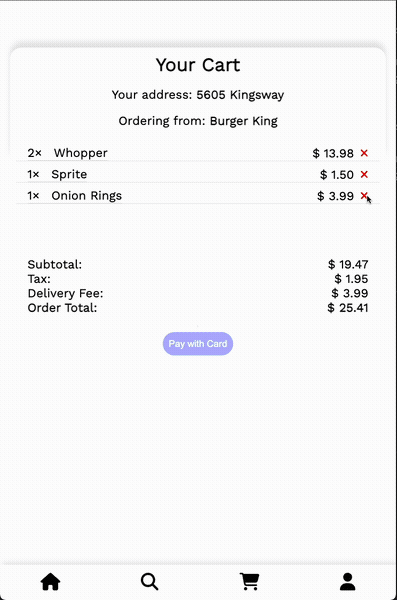
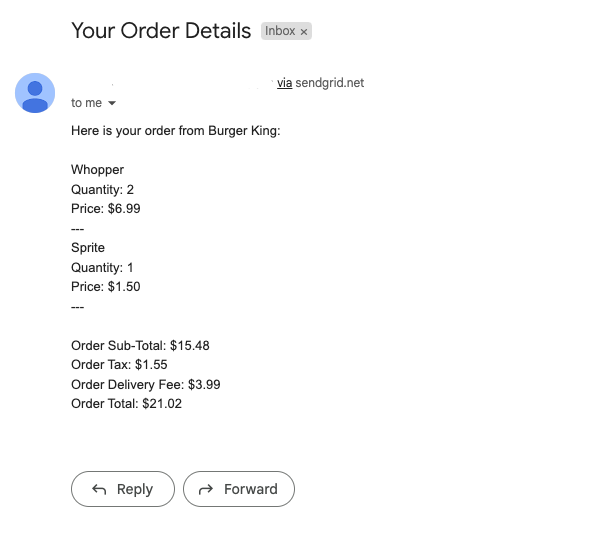
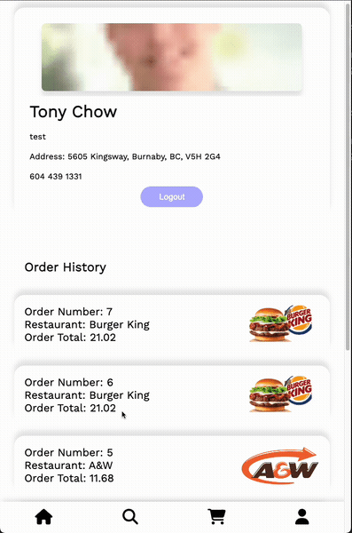
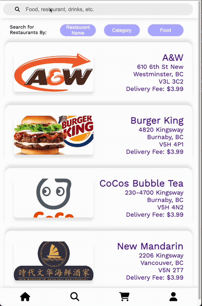
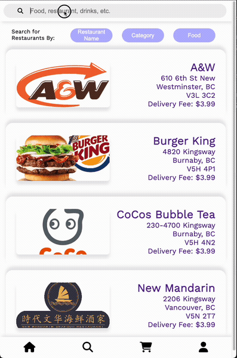
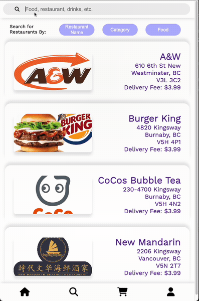

# DASH DINE

DASH DINE is the user-side clone of Uber Eats, where users can agonise over all the possible food options in the city before settling on what they are comfortable with! Currently only for GVRD region.

# Table of Contents

1. [Getting Started](#getting-started)
2. [PostGreSQL Setup](#postgresql-setup)
3. [Features](#features)
4. [Environment](#environment)
5. [Dependencies](#dependencies)
6. [Interface Images/GIFs](#interface-imagesgifs)

## Getting Started

1. Clone this repo: `git clone git@github.com:John-Roxas/LHLFinal.git`.
2. This app uses PostgreSQL - please refer to [PostgreSQL Setup](###PostgreSQL-Setup).
3. Open the server directory `cd server`.
4. Ensure that you are using node version 12 or later: `node -v`.
5. Install the dependencies: `npm i`.
6. Copy the .env file `cp .env.example .env`.
7. If you are using your own PostgreSQL credentials, update the `DB_USER` and `DB_PASS` fields in .env accordingly.
8. Create and seed your database: `npm run db:reset`
9. Run the server: `npm start`.
10. In a separate terminal, open the react app folder: `cd my-app`.
11. Install the dependencies: `npm i`.
12. Start the React app: `npm start`.
13. The app should launch automatically in your default browser. The app can also be accessed directly at `localhost:[PORT]`. The default port is `3000`.

### PostGreSQL Setup

1. You will require PostgreSQL to use this application; please ensure that it is installed. If not, you can download PostgreSQL [here](https://www.postgresql.org/about/).
2. Start PostgreSQL: `psql` - please note that if you are on WSL, you will need to use the following command first: `startposgresql`.

## Features

1. Multipage breakdown of main app features!
   1. Home page
      1. Shows a list of all restautants for not-logged-in users
      2. Shows an additional side-scrolling carousel of restaurants previously ordered from
      3. A login button, because how else are you supposed to order food?
   2. Search page
      1. Search by restaurant name
      2. Search by food category (e.g., drinks, fast food)
      3. Search by food name, which returns specific menu items
   3. Restaurant-specific pages
      1. Shows a full list of offerings from a restaurant
      2. View the restaurant location relative to your address using Leaflet, a Google Maps alternative
   4. Shopping cart page
      1. Displays a list of all items added to the cart
      2. Allows users to delete previously added items - we're allowed to change our minds!
      3. Checkout using Stripe, a popular and well-supported payment API
   5. Profile page
      1. View your user details
      2. View your recent orders
      3. A logout button, because nobody wants to trap their users in a perpetually logged-in state!
2. Restaurant database - insert restaurants directly using SQL queries. Worry not - we're working on a restaurant entry page.

## Environment

- Node V12.22.xx or higher

## Dependencies

### Application

- Font Awesome: v6.4.0
- Stripe: v12.16.0
- Axios: v1.4.0
- Http-proxy-middleware: v2.0.6
- Leaflet: v1.9.4
- Leaflet routing machine: v3.2.12
- React: v18.2.0

### Server

- Body parser: v1.20.2
- Chalk: v2.4.2
- Cookie-session: v2.0.0
- CORS: v2.8.5
- Dotenv: v2.0.0
- EJS: v2.6.2
- Express: v4.17.1
- Morgan: v.1.9.1
- Postgres: v8.5.0
- Sass: v1.35.1

## Interface Images/GIFs

### Browsing Pages

### Login

### Map

### Adding Items to Cart

### Checkout

### Email Receipt

### Order History

### Logout

### Search Restaurant

### Search Category

### Search Food

